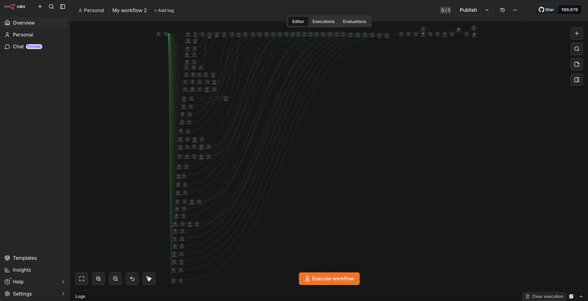

# AI-Assisted Job Discovery Pipeline

A personal automation system that monitors **41 company career sites**, filters irrelevant roles using deterministic logic, and uses Claude Haiku to evaluate the remaining jobs based on transferable capabilities rather than job-title similarity.

I built it with **n8n, Claude, Browserless, APIs, Google Sheets, and Gmail** to make my own job search broader and more systematic.

## Demo version

This repository contains a **sanitized representative version** of the workflow.

The production system monitors 41 career sites across multiple ATS platforms. The public demo includes only a small subset of integrations to show the core architecture, filtering logic, AI matching, and output flow without publishing the full production implementation.

## How it works

1. Fetches job postings from multiple career platforms
2. Normalizes them into a common format
3. Applies deterministic title and location filters
4. Removes jobs already seen
5. Sends only the remaining roles to Claude Haiku
6. Parses the response into structured fit data
7. Writes matches to Google Sheets and sends an email digest

Keeping deterministic logic before the AI step reduces unnecessary API calls and keeps normal operating cost around **$1.50–3 CAD/month**.

## Workflow overview

